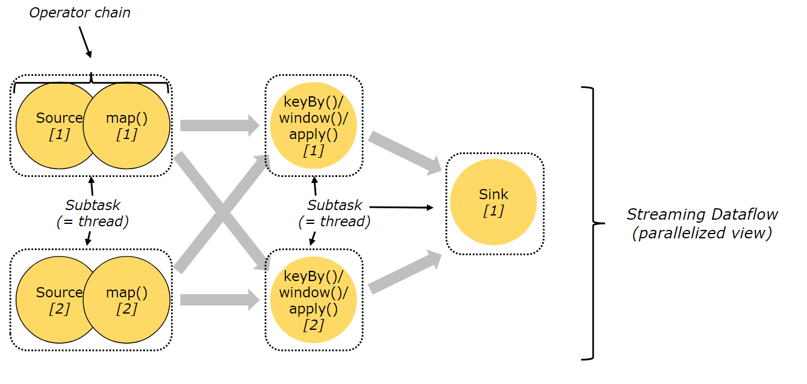

# [Flink Architecture](https://ci.apache.org/projects/flink/flink-docs-release-1.12/concepts/flink-architecture.html)

## Flink 集群

- 
- 一个flink集群由一个JobManager 和 一个或多个TaskManager 组成
- Client 用于准备参数配置, 生成StreamGraph等, 将其发送给JobManager

### JobManager

```text
JobManager 具有许多与协调 Flink 应用程序的分布式执行有关的职责：它决定何时调度下一个 task（或一组 task）、对完成的 task 或执行失败做出反应、协调 checkpoint、并且协调从失败中恢复等等。这个进程由三个不同的组件组成：
```

- #### **ResourceManager**
    - 负责Flink集群中的资源申请, 回收, 分配(管理 task slots),
    - Flink 为不同的资源管理框架提供了对应的ResourceManager实现
- #### **Dispatcher**
    - 运行Flink webUI, 提供作业执行信息
    - 提供一个Rest接口
- #### **JobMaster**
    - 负责管理单个JobGraph的执行

### TaskManager

```text
TaskManager（也称为 worker）执行作业流的 task，并且缓存和交换数据流。
```

- 必须始终至少有一个 TaskManager。在 TaskManager 中资源调度的最小单位是 task slot。TaskManager 中 task slot 的数量表示并发处理 task 的数量。
- 请注意一个 task slot 中可以执行多个算子（请参考Tasks和 Operator Chain）

## Tasks和 Operator Chain

- Flink 将多个Operator chain 到1个线程中(1个subtask), 以减少线程间数据传递带来的线程切换和缓冲开销, 增加整体的吞吐
    - flink 默认会将能链接的Operator尽可能的Chain在一个线程, 提升性能,
      修改默认配置方式:[算子链和资源组](https://ci.apache.org/projects/flink/flink-docs-release-1.12/zh/dev/stream/operators/#task-chaining-and-resource-groups)
    - 

## Task Slots 和 Resources

- 每个 TaskManager 都是1个独立的JVM进程, 可以在单独的线程中执行一个或多个subtask, 为了控制一个TaskManager中接受多少个task, 就有了task slots的概念
    - task slot 是 TaskManager中资源的固定子集. 例如:
        - 3个slot 的TaskManager, 会将1/3的TaskManager内存用于每个slot
        - 没有CPU隔离, 当前slot仅分离task的托管内存.

    - 
- 有多个slot的TaskManager意味着多个subtask共享一个JVM
    - 同一个JVM中task共享TCP连接(多路复用)和心跳信息
    - 共享数据集和数据结构, 从而减少每个task的开销

- 默认情况下, Flink允许subtask共享slot, 即便是不同task的subtask, 只要是来自同一个作业即可(某些情况下, 一个slot可以持有整个作业的pipeline)
- 允许slot共享的两个优点:
    - Flink 集群所需的 task slot 和作业中使用的最大并行度恰好一样, 无需计算程序总共包含多少个task
    - 容易获得更好的资源利用.
        - 非密集型subtask(source/map)将阻塞和密集型subtask(window)一样多的资源. 通过共享slot, 可以充分利用资源, 同时确保繁重的subtask在TaskManager直接公平分配.
    - 

## Flink Application Execution

- **集群生命周期**
    - 多个job共享一个JobManager
- 一般测试用

### Flink Job Cluster (之前称为 per-job模式)

- **集群生命周期**
    - Flink job 集群中, 可以使用yarn或k8s资源管理, 为每个提交的job(作业)启动一个集群, 并且该集群仅用于该作业.
    - Client 端首先向yarn或k8s请求资源启动JobManager, 然后将job提交给在这个进程用允许的Dispatcher. 然后根据作业的请求分配TaskManager.
    - 一旦job完成, 则Flink job 集群将被销毁.
- **资源隔离**
    - JobManager 中的致命异常仅影响当前作业
- **其他注意事项**
    - 由于JobManager中的ResourceManager必须等待外部资源管理器(yarn,k8s)来启动TaskManager进程和资源分配. 因此Flink job集群更适合长期运行, 且具有高稳定性,
      且对较长启动时间不敏感的大型作业.

### Flink Application Cluster

- [官网](https://ci.apache.org/projects/flink/flink-docs-release-1.12/zh/concepts/flink-architecture.html#flink-application-%E9%9B%86%E7%BE%A4)
