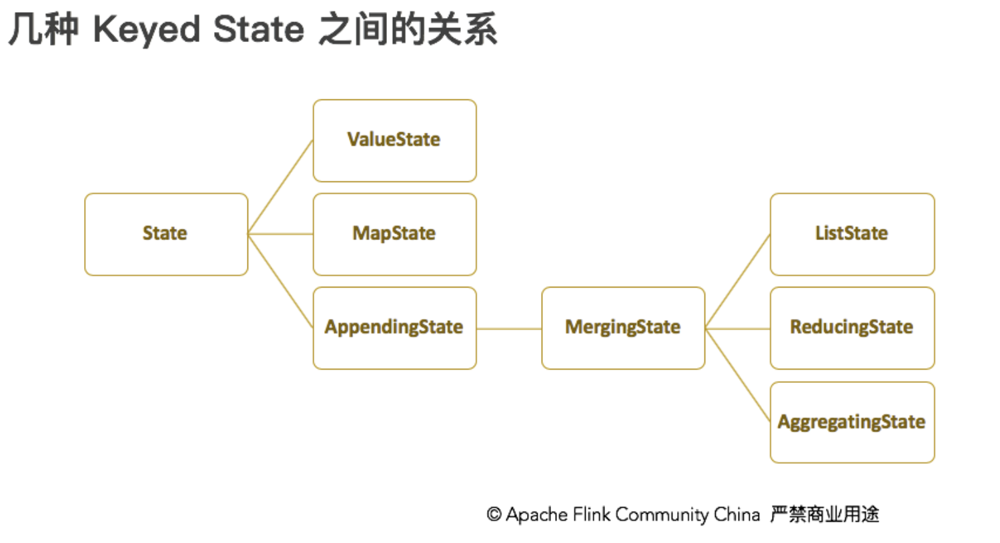

## [Stateful Stream Processing](https://ci.apache.org/projects/flink/flink-docs-release-1.12/zh/concepts/stateful-stream-processing.html)

- 导航
    - [State](#state)
    - [Keyed State](#keyed-state)
    - [state-backends-状态与容错](#state-backends-状态与容错)
        - [checkpoint](#checkpoint-1)
        - [savepoint](#savepoint-1)

### 什么是State?

- Flink 从 checkpoint 和 savepoint 获取状态, 保证容错.
- [Queryable state](https://ci.apache.org/projects/flink/flink-docs-release-1.12/dev/stream/state/queryable_state.html)
  allows you to access state from outside of Flink during runtime.
- Flink
  提供了不同的 [State Backends](https://ci.apache.org/projects/flink/flink-docs-release-1.12/zh/ops/state/state_backends.html)
  支持存储方式和存储位置

#### State

- Raw State
    - ```text
      用户自己管理
      用户自定义算子
      只支持字节 byte[] 存储,
      ```
- Managed State (包含 **Keyed State**, **Operator State**):
    - ```text
      Flink Runtime托管, 自动存储, 自动恢复, 自动伸缩
      绝大多数Flink算子 
      常用数据结构, ListState, MapState
      ```
    - **Keyed State**
        - KeyedStream 上的状态, 每个key对应一个state
            - 仅适用于KeyedStream算子
            - 每个key对应一个state
        - (实现)访问方式: **重写 RichXxxFunction, 通过RuntimeContext 访问**
        - state随着key自动在多个算子上迁移
        - 支持的数据结构: ValueState, ListState, MapState, ReducingState, AggregatingState
            - 
    - **Operator State**
        - 可用在所有算子上, 每个 Operator task 共享一个状态, 流入这个算子的task数据都可以访问和更新这个状态
            - 适用所有算子(Operator)
            - 一个Operator对应一个state
        - (实现)访问方式
            - implement **CheckpointedFunction** 等
        - 多种状态重新分配的方式
        - 支持的数据结构: ListState, BroadCastState 等

#### State 适用场景

- 去重
    - 记录key, 去重
- 窗口计算
    - 每隔指定时间触发窗口的计算, 窗口中未触发数据也是一种状态
- 机器学习&DL
    - 训练的模型以及当前的参数也是一种状态
    - 数据集的操作都需要状态保存
- 访问历史数据
    - 与昨天的历史数据对比 (用的不多, 可以从外部读取)

### Keyed State

- Key State 是 KeyedStream 上的状态
    - 访问 key/value state 只有在 keyed stream 上(例如, keyed/partition )
    - 
- Keyed State 进一步组成所谓的 Key Groups.

### State Persistence

- #### Checkpoint

    - Checkpoint Barriers
    - Snapshotting Operator State
    - Recovery

- #### State Backends

- #### Savepoint

- #### Exactly Once & At Least Once

# State Backends (状态与容错)

## [State & Fault Tolerance ](https://ci.apache.org/projects/flink/flink-docs-release-1.12/ops/state/checkpoints.html)

### checkpoint

```text
定期制作分布式快照, 对程序中的状态进行备份
发生故障时, 将整个作业的task都回滚到最后一次成功的Checkpoint状态, 然后从那个点继续处理
必要条件: 数据源支持重发(例如kafka)
一致性语义: EXACTLY_ONCE, AT_LAST_ONCE

checkpoint 
Flink自动触发与管理, 主要用于task发生异常时自动恢复
默认情况下仅用于恢复失败作业, 作业结束则删除 (可配置)

checkpointConfig.enableExternalizedCheckpoints(ExternalizedCheckpointCleanup.RETAIN_ON_CANCELLATION)
checkpointConfig.enableExternalizedCheckpoints(ExternalizedCheckpointCleanup.DELETE_ON_CANCELLATION)

ExternalizedCheckpointCleanup.RETAIN_ON_CANCELLATION: 作业取消时, 保留作业的checkpoint, (副作用, 需要手动删除)
ExternalizedCheckpointCleanup.DELETE_ON_CANCELLATION: 作业取消时, 删除作业的checkpoint, 仅当作业失败时保留checkpoint (推荐)
```

- #### 目录结构
    - ```text
      /user-defined-checkpoint-dir
          /{job-id}
          |
          + --shared/
          + --taskowned/
          + --chk-1/
          + --chk-2/
          + --chk-3/
          ...
      ```

- #### 可用的 State Backends
    - ##### **MemoryStateBackend (默认)**
        - MemoryStateBackend 使用限制
            - 默认, 每个独立state 大小 5M, 在 MemoryStateBackend 的构造器中可以增加其大小。
            - 无论配置的最大状态内存大小（MAX_MEM_STATE_SIZE）有多大，都不能大于 akka.framesize
              大小[看配置参数](https://ci.apache.org/projects/flink/flink-docs-release-1.12/zh/deployment/config.html#rpc--akka)
            - 聚合后的状态必须能够放进 JobManager 的内存中。
        - MemoryStateBackend 适用场景
            - 本地开发和调试
            - 状态很小的job, 由算子(Map, Flatmap, Filter)等 一对一算子构成的job
        - 注意
            - 建议同时将 [managed memory](https://ci.apache.org/projects/flink/flink-docs-release-1.12/deployment/memory/mem_setup_tm.html)
            设为0，以保证将最大限度的内存分配给 JVM 上的用户代码。

    - ##### **FsStateBackend**
        - FsStateBackend 特性
            - FsStateBackend 将正在运行中的状态数据保存在 TaskManager 的内存中
            - CheckPoint 时，将状态快照写入到配置的文件系统目录中。 少量的元数据信息存储到 JobManager 的内存中（高可用模式下，将其写入到 CheckPoint 的元数据文件中）.
        - FsStateBackend 使用场景
            - 状态比较大, 窗口比较长(分钟级别), key/value 状态比较大的job
            - 所有高可用的场景
        - 注意
            - 建议同时将 [managed memory](https://ci.apache.org/projects/flink/flink-docs-release-1.12/deployment/memory/mem_setup_tm.html)
            设为0，以保证将最大限度的内存分配给 JVM 上的用户代码。

    - ##### **RocksDBStateBackend**
        - RocksDBStateBackend 的限制：
            - RocksDBStateBackend 只支持异步快照。
            - 由于 RocksDB 的 JNI API 构建在 byte[] 数据结构之上, 所以每个 key 和 value 最大支持 2^31 字节。 重要信息: RocksDB
              合并操作的状态（例如：ListState）累积数据量大小可以超过 2^31 字节，但是会在下一次获取数据时失败。这是当前 RocksDB JNI 的限制。
        - 适用场景
            - 状态非常大、窗口非常长(天级别)、key/value 状态非常大的 Job。
            - 所有高可用的场景。
            - 需要开启HA的作业
            - 对state读写性能要求不高的作业
        - 全局配置方式
            - flink-conf.yaml
                - ```text
                  state.backend: rocksdb
                  # 增量快照
                  state.backend.incremental: true 
                  state.checkpoints.dir: hdfs://{nameservice}/flink/checkpoints
                  ```
        - 单个job的 state backend
            - ```text
              <dependency>
                <groupId>org.apache.flink</groupId>
                <artifactId>flink-statebackend-rocksdb_2.11</artifactId>
                <version>1.12.0</version>
                <scope>provided</scope>
              </dependency>
              ```
            - ```text
              StreamExecutionEnvironment env = StreamExecutionEnvironment.getExecutionEnvironment();
              env.setStateBackend(new FsStateBackend("hdfs://namenode:40010/flink/checkpoints"));
              ```

#### [RocksDB 进阶](https://ci.apache.org/projects/flink/flink-docs-release-1.12/zh/ops/state/state_backends.html#rocksdb-state-backend-%E8%BF%9B%E9%98%B6)

#### checkpoint 和 savepoint 的区别

- checkpoint 可以使用 rocksdb 增量存储
- checkpoint 不支持扩缩容(改变并行度)

#### 从checkpoint恢复状态

- ```shell
  $ bin/flink run -s :checkpointMetaDataPath [:runArgs]
  ```

### savepoint

```text
savepoint 类似于全量备份, 用户手动触发.
用途: 有计划的备份, 使作业能停止后恢复, 可以调整逻辑, 改名并行度, 以及蓝绿部署
允许代码或配置发生改变

```

#### Operator ids

- 如果不指定, 将会自动生成id, 只要这些id不变, 就可以从savepoint自动恢复.
- 生成的id取决于程序的结构, 并且对程序更改敏感. 因此, **强烈建议手动分配这些id**.
- uid(String) 方法手动指定算子id, 这些id将用于恢复 Operator state
    ```java
    DataStream<String> stream = env.
      // Stateful source (e.g. Kafka) with ID
      .addSource(new StatefulSource())
      .uid("source-id") // ID for the source operator
      .shuffle()
      // Stateful mapper with ID
      .map(new StatefulMapper())
      .uid("mapper-id") // ID for the mapper
      // Stateless printing sink
      .print(); // Auto-generated ID
    ```

#### Savepoint 常用操作

- 触发savepoint
  ```shell
  $ bin/flink savepoint :jobId [:targetDirectory]
  ```

- 使用Yarn触发savepoint
  ```shell
  $ bin/flink savepoint :jobId [:targetDirectory] -yid :yarnAppId
  ```
- 使用 Savepoint 取消作业
  ```shell
  $ bin/flink cancel -s [:targetDirectory] :jobId
  ```
- 从 Savepoint 恢复
  ```shell
  $ bin/flink run -s :savepointPath [:runArgs]
  # 跳过无法映射的状态恢复
  $ bin/flink run -s :savepointPath --allowNonRestoredState [:runArgs]
  ```
- 删除 savepoint
  ```shell
  $ bin/flink savepoint -d :savepointPath
  ```

### [Tuning Checkpoints and Large State](https://ci.apache.org/projects/flink/flink-docs-release-1.12/ops/state/large_state_tuning.html)
