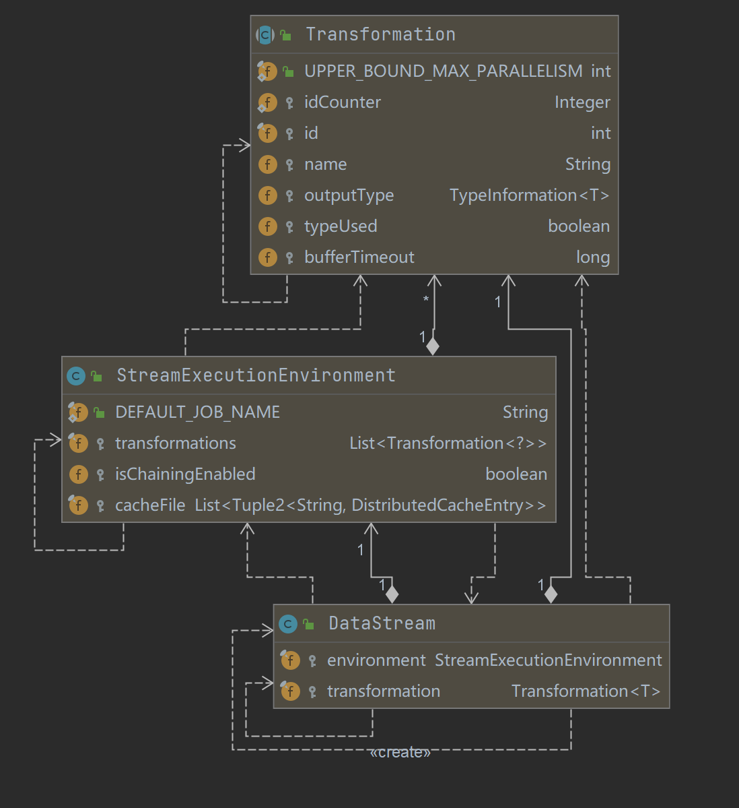
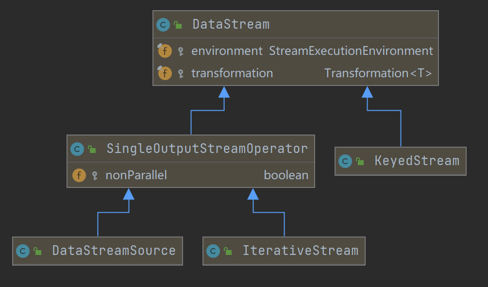

# DataStream & StreamGraph 生成

## version 1.12.0

### DataStream & Transformation

- UML
    - 
- StreamExecutionEnvironment
    - 是1个Stream上下文信息
    - 提供了控制job执行的方法,和与外界交互的链接信息
        - set parallelism
        - checkpoint 参数

- DataStream 等算子操作, 会抽象成 Transformation 列表, 存到 StreamExecutionEnvironment 的 transformations列表中
    - DataStream 的子类
        - 

## StreamGraph -> JobGraph -> ExecutionGraph

### StreamGraph 的生成

- UML
    - 

- StreamGraph 生成
  ```text
  1. StreamExecutionEnvironment 根据transformations, config 等, 构造出 StreamGraphGenerator
  2. StreamGraphGenerator 创建 StreamGraph, 并遍历 transformations 设置 StreamNode 和 StreamEdge 组成 DAG
  ```
    - {@link StreamExecutionEnvironment}, 根据transformations, config 等, 构造出 StreamGraphGenerator
        - ```java
          /** The execution configuration for this environment. */
          private final ExecutionConfig config = new ExecutionConfig();
        
          /** Settings that control the checkpointing behavior. */
          private final CheckpointConfig checkpointCfg = new CheckpointConfig();
        
          protected final List<Transformation<?>> transformations = new ArrayList<>();
          
          /**
            * {@link StreamExecutionEnvironment}
            *
            * @return
            */
          @Internal
          public StreamGraph getStreamGraph(String jobName, boolean clearTransformations) {
              StreamGraph streamGraph = getStreamGraphGenerator().setJobName(jobName).generate();
              if (clearTransformations) {
                  this.transformations.clear();
              }
              return streamGraph;
          }
          
          private StreamGraphGenerator getStreamGraphGenerator() {
              if (transformations.size() <= 0) {
                  throw new IllegalStateException("No operators defined in streaming topology. Cannot execute.");
              }
              // 获取 execution.runtime-mode 参数
              final RuntimeExecutionMode executionMode = configuration.get(ExecutionOptions.RUNTIME_MODE);
        
              return new StreamGraphGenerator(transformations, config, checkpointCfg, getConfiguration())
                  .setRuntimeExecutionMode(executionMode)
                  .setStateBackend(defaultStateBackend)
                  .setChaining(isChainingEnabled)
                  .setUserArtifacts(cacheFile)
                  .setTimeCharacteristic(timeCharacteristic)
                  .setDefaultBufferTimeout(bufferTimeout);
          }
          ```
    - {@link StreamGraphGenerator#generate} 方法生成 StreamGraph, 并且
        - ```java
          /**
           * {@link StreamGraphGenerator#generate}
           *
           * @return
           */
          public StreamGraph generate() {
              streamGraph = new StreamGraph(executionConfig, checkpointConfig, savepointRestoreSettings);
              shouldExecuteInBatchMode = shouldExecuteInBatchMode(runtimeExecutionMode);
              configureStreamGraph(streamGraph);
              alreadyTransformed = new HashMap<>();
          
              /**
              * 1. 匹配 Transformation 实现类 xxxTransformation对应的 xxxTransformationTranslator 包装类(实现自接口TransformationTranslator Context 上下文包含StreamGraph等); 
              * 2. 调用 xxxTransformationTranslator 父类 AbstractOneInputTransformationTranslator#translateInternal;
              * 3. 
              */
              for (Transformation<?> transformation: transformations) {
                  transform(transformation);
              }
          
              final StreamGraph builtStreamGraph = streamGraph;
              alreadyTransformed.clear();
              alreadyTransformed = null;
              streamGraph = null;
              return builtStreamGraph;
          }
          ```
