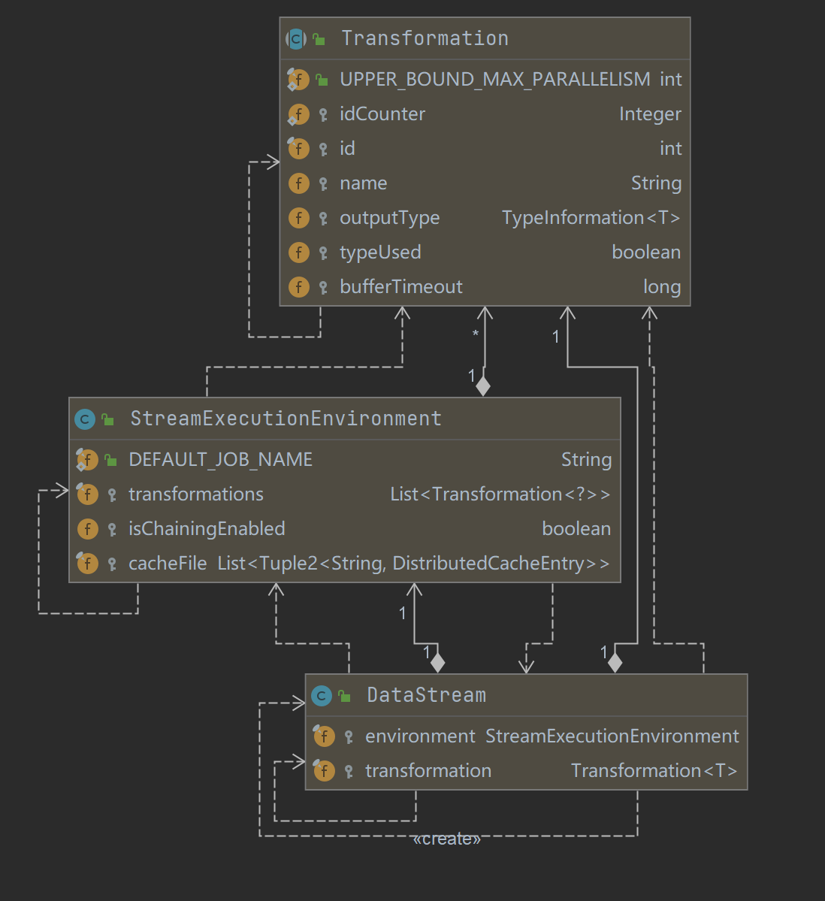
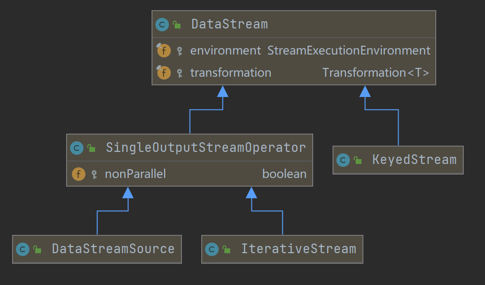
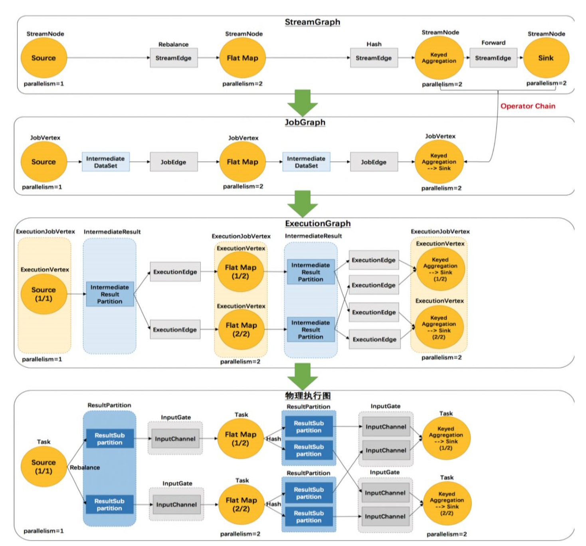
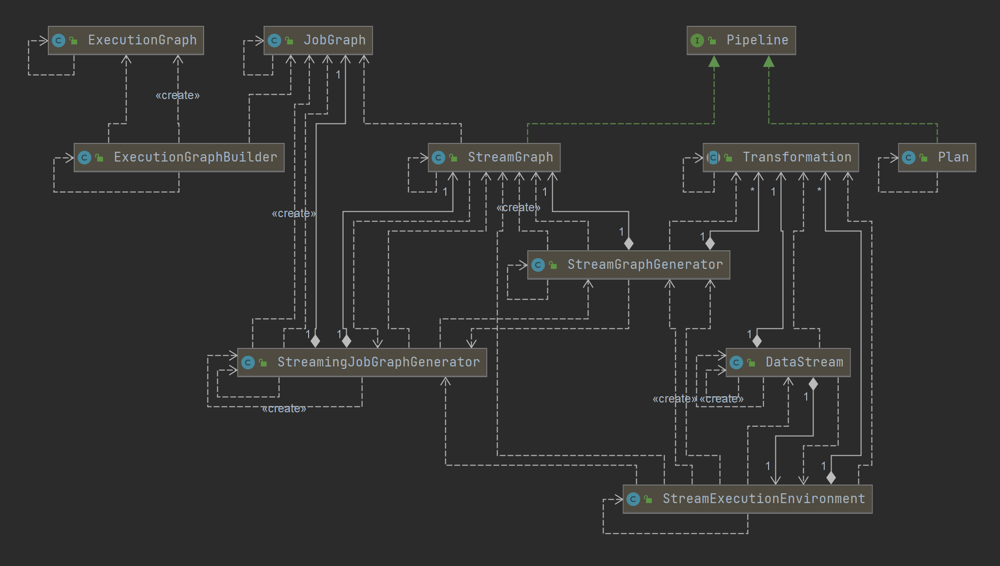

# DataStream & StreamGraph 生成

- [DataStream & Transformation & StreamOperator](#datastream--transformation--streamoperator)
- [StreamGraph 的生成](#streamgraph-的生成)
- [JobGraph 的生成](#jobgraph-的生成)

(current version 1.12.0)

## DataStream & Transformation & StreamOperator

- UML
    - 
- #### StreamExecutionEnvironment
    - 是1个Flink 作业的上下文信息, 包含 ExecuteConfig 和 CheckPointConfig, 用户jar信息.
    - transformations 列表.
    - 提供了控制job执行的方法,和与外界交互的链接信息
        - set parallelism
        - checkpoint 参数

- #### DataStream & Transformation
    - DataStream 表示了由一种类型构成的数据流
    - 通过算子操作, 可以将一个DataStream转化为另一个DataStream, 转化的过程会抽象成 Transformation , 存到 StreamExecutionEnvironment 的
      transformations列表中
        - **也就是说**: 在 DataStream 上面通过算子不断进行转换，就得到了由 Transformation 构成的图。当需要执行的时候，底层的这个图就会被转换成 StreamGraph
        - DataStream.map 算子**为例**, **每个算子都会加入 StreamExecutionEnvironment 的 transformations 列表中**.
          ```java
          /**
           * A DataStream represents a stream of elements of the same type. A DataStream can be transformed
           * into another DataStream by applying a transformation as for example:
           *
           * <ul>
           *   <li>{@link DataStream#map}
           *   <li>{@link DataStream#filter}
           * </ul>
           *
           * @param <T> The type of the elements in this stream.
           */
          @Public
          public class DataStream<T> {
          
              public <R> SingleOutputStreamOperator<R> map(
                  MapFunction<T, R> mapper, TypeInformation<R> outputType) {
                  return transform("Map", outputType, new StreamMap<>(clean(mapper)));
              }
          
              @PublicEvolving
              public <R> SingleOutputStreamOperator<R> transform(
                  String operatorName,
                  TypeInformation<R> outTypeInfo,
                  OneInputStreamOperator<T, R> operator) {
                  return doTransform(operatorName, outTypeInfo, SimpleOperatorFactory.of(operator));
              }
  
              protected <R> SingleOutputStreamOperator<R> doTransform(
                      String operatorName,
                      TypeInformation<R> outTypeInfo,
                      StreamOperatorFactory<R> operatorFactory) {
        
                    // read the output type of the input Transform to coax out errors about MissingTypeInfo
                    transformation.getOutputType();
        
                  OneInputTransformation<T, R> resultTransform =
                        new OneInputTransformation<>(
                                this.transformation,
                                operatorName,
                                operatorFactory,
                                outTypeInfo,
                                environment.getParallelism());
        
                  @SuppressWarnings({"unchecked", "rawtypes"})
                  SingleOutputStreamOperator<R> returnStream =
                        new SingleOutputStreamOperator(environment, resultTransform);
        
                  /** 
                   * 算子添加到, ExecutionEnvironment 的 transformations 列表中 
                   */
                  getExecutionEnvironment().addOperator(resultTransform);
                  return returnStream;
              }
          }
          ```
    - Transformation 有一系列子类
    - DataStream 的子类
        - 

- #### StreamOperator [实现细节](03-Function-Operator.md)
    - StreamOperator 定义了对一个具体的算子的生命周期的管理

```text
DataStream –> Transformation –> StreamOperator 这样的依赖关系，就可以完成 DataStream 的转换.
并且保留算子之间的依赖关系。
```

## 用户代码 -> StreamGraph -> JobGraph -> ExecutionGraph

- ```text
  StreamGraph: 从source开始, 遍历 transformations 生成 SteamNode 和 StreamEdge, 组成 StreamGraph (DAG)
  JobGraph: 从source开始, 遍历能 chain 到一起的 operator, 
      如果可以chain则chain到一起生成JobVertex, 不能chain的生成单独的JobVertex.
      通过 JobEdge 链接上下游的 JobVertex, 组成 JobGraph
  ExecutionGraph: jobVertex DAG 提交到任务以后，从 Source 节点开始排序,
      根据 JobVertex 生成ExecutionJobVertex，根据 jobVertex的IntermediateDataSet 构建IntermediateResult，
      然后 IntermediateResult 构建上下游的依赖关系， 形成 ExecutionJobVertex 层面的 DAG 即 ExecutionGraph。
  ```

### StreamGraph 的生成

- 整体图: StreamGraph -> JobGraph -> ExecutionGraph
    - 
- UML
    - 

- #### StreamGraph [数据结构](02-StreamNode-JobVertex.md#streamgraph--streamnode)

- #### StreamGraph 生成

    - 1.StreamExecutionEnvironment.execute() 开始执行, 根据transformations, config 等, **构造出 StreamGraphGenerator**
    - 2.StreamGraphGenerator 遍历 transformations 构造出 StreamNode 和 StreamEdge 组成 DAG, 即 StreamGraph
        - StreamNode 是来描述 operator 的逻辑节点, 关键属性有 inEdges, outEdges , Class<? extends AbstractInvokable> jobVertexClass,
          slotSharingGroup slotSharingGroup
            - 每个StreamNode对象都携带有parallelism, slotSharingGroup, 执行类信息
        - StreamEge 是用来描述两个 operator 边(关系), 关键属性有 StreamNode sourceVertex, StreamNode targetVertex
    - {@link [StreamExecutionEnvironment](https://github.com/apache/flink/blob/master/flink-streaming-java/src/main/java/org/apache/flink/streaming/api/environment/StreamExecutionEnvironment.java#L131) }, 根据transformations, config 等, 构造出 StreamGraphGenerator
        - ```java
          /**
           * The StreamExecutionEnvironment is the context in which a streaming program is executed. 
           * A {@link LocalStreamEnvironment} will cause execution in the current JVM,
           * a {@link RemoteStreamEnvironment} will cause execution on a remote setup.
           *
           * <p>The environment provides methods to control the job execution (such as setting the parallelism
           * or the fault tolerance/checkpointing parameters) and to interact with the outside world (data
           * access).
           *
           * @see org.apache.flink.streaming.api.environment.LocalStreamEnvironment
           * @see org.apache.flink.streaming.api.environment.RemoteStreamEnvironment
           */
          @Public
          public class StreamExecutionEnvironment {
              /** The execution configuration for this environment. */
              private final ExecutionConfig config = new ExecutionConfig();
            
              /** Settings that control the checkpointing behavior. */
              private final CheckpointConfig checkpointCfg = new CheckpointConfig();
            
              protected final List<Transformation<?>> transformations = new ArrayList<>();
                 
              /**
                * Getter of the {@link org.apache.flink.streaming.api.graph.StreamGraph} of the streaming job.
                * This call clears previously registered {@link Transformation transformations}.
                *
                @param jobName Desired name of the job
                * @return The streamgraph representing the transformations
               */
              @Internal
              public StreamGraph getStreamGraph(String jobName, boolean clearTransformations) {
                  StreamGraph streamGraph = getStreamGraphGenerator().setJobName(jobName).generate();
                  if (clearTransformations) {
                      this.transformations.clear();
                  }
                  return streamGraph;
              }
              
              private StreamGraphGenerator getStreamGraphGenerator() {
                  if (transformations.size() <= 0) {
                      throw new IllegalStateException("No operators defined in streaming topology. Cannot execute.");
                  }
                  // 获取 execution.runtime-mode 参数
                  final RuntimeExecutionMode executionMode = configuration.get(ExecutionOptions.RUNTIME_MODE);
            
                  return new StreamGraphGenerator(transformations, config, checkpointCfg, getConfiguration())
                      .setRuntimeExecutionMode(executionMode)
                      .setStateBackend(defaultStateBackend)
                      .setChaining(isChainingEnabled)
                      .setUserArtifacts(cacheFile)
                      .setTimeCharacteristic(timeCharacteristic)
                      .setDefaultBufferTimeout(bufferTimeout);
              }
          }
          ```
    - {@link [StreamGraphGenerator#generate](https://github.com/apache/flink/blob/master/flink-streaming-java/src/main/java/org/apache/flink/streaming/api/graph/StreamGraphGenerator.java) } 
      方法生成 StreamGraph, 并且获得transformationId 列表
        - ```java
          /**
           * A generator that generates a {@link StreamGraph} from a graph of {@link Transformation}s.
           *
           * <p>This traverses the tree of {@code Transformations} starting from the sinks. At each
           * transformation we recursively transform the inputs, then create a node in the {@code StreamGraph}
           * and add edges from the input Nodes to our newly created node. The transformation methods return
           * the IDs of the nodes in the StreamGraph that represent the input transformation. Several IDs can
           * be returned to be able to deal with feedback transformations and unions.
           *
           * <p>Partitioning, split/select and union don't create actual nodes in the {@code StreamGraph}. For
           * these, we create a virtual node in the {@code StreamGraph} that holds the specific property, i.e.
           * partitioning, selector and so on. When an edge is created from a virtual node to a downstream
           * node the {@code StreamGraph} resolved the id of the original node and creates an edge in the
           * graph with the desired property. For example, if you have this graph:
           *
           * <pre>
           *     Map-1 -&gt; HashPartition-2 -&gt; Map-3
           * </pre>
           *
           * <p>where the numbers represent transformation IDs. We first recurse all the way down. {@code
           * Map-1} is transformed, i.e. we create a {@code StreamNode} with ID 1. Then we transform the
           * {@code HashPartition}, for this, we create virtual node of ID 4 that holds the property {@code
           * HashPartition}. This transformation returns the ID 4. Then we transform the {@code Map-3}. We add
           * the edge {@code 4 -> 3}. The {@code StreamGraph} resolved the actual node with ID 1 and creates
           * and edge {@code 1 -> 3} with the property HashPartition.
           */
          @Internal
          public class StreamGraphGenerator {
          
              /**
               * {@link StreamGraphGenerator#generate}
               * A generator that generates a {@link StreamGraph} from a graph of {@link Transformation}s.
               * @return
               */
              public StreamGraph generate() {
                  streamGraph = new StreamGraph(executionConfig, checkpointConfig, savepointRestoreSettings);
                  shouldExecuteInBatchMode = shouldExecuteInBatchMode(runtimeExecutionMode);
                  configureStreamGraph(streamGraph);
                  alreadyTransformed = new HashMap<>();
              
                  /**
                  * 1. 策略模式 匹配 xxxTransformation对应的 xxxTransformationTranslator 包装类(实现自接口TransformationTranslator Context 上下文包含StreamGraph等); 
                  * 2. 调用 xxxTransformationTranslator 父类 AbstractOneInputTransformationTranslator#translateInternal;
                  *    - StreamGraph 添加 Operator
                  */
                  for (Transformation<?> transformation: transformations) {
                      transform(transformation);
                  }
              
                  final StreamGraph builtStreamGraph = streamGraph;
                  alreadyTransformed.clear();
                  alreadyTransformed = null;
                  streamGraph = null;
                  return builtStreamGraph;
              }
          }
          ```
        - 最终调用 AbstractOneInputTransformationTranslator#translateInternal()
          ```java
          /**
           * A utility base class for one input {@link Transformation transformations} that provides a
           * function for configuring common graph properties.
           */
          abstract class AbstractOneInputTransformationTranslator<IN, OUT, OP extends Transformation<OUT>> extends SimpleTransformationTranslator<OUT, OP> {
              protected Collection<Integer> translateInternal(
                  final Transformation<OUT> transformation,
                  final StreamOperatorFactory<OUT> operatorFactory,
                  final TypeInformation<IN> inputType,
                  @Nullable final KeySelector<IN, ?> stateKeySelector,
                  @Nullable final TypeInformation<?> stateKeyType,
                  final Context context) {
              checkNotNull(transformation);
              checkNotNull(operatorFactory);
              checkNotNull(inputType);
              checkNotNull(context);
            
                final StreamGraph streamGraph = context.getStreamGraph();
                final String slotSharingGroup = context.getSlotSharingGroup();
                final int transformationId = transformation.getId();
                final ExecutionConfig executionConfig = streamGraph.getExecutionConfig();
            
                streamGraph.addOperator(
                    transformationId,
                    slotSharingGroup,
                    transformation.getCoLocationGroupKey(),
                    operatorFactory,
                    inputType,
                    transformation.getOutputType(),
                    transformation.getName());
            
                if (stateKeySelector != null) {
                    TypeSerializer<?> keySerializer = stateKeyType.createSerializer(executionConfig);
                    streamGraph.setOneInputStateKey(transformationId, stateKeySelector, keySerializer);
                }
            
                int parallelism = transformation.getParallelism() != ExecutionConfig.PARALLELISM_DEFAULT
                    ? transformation.getParallelism()
                    : executionConfig.getParallelism();
                streamGraph.setParallelism(transformationId, parallelism);
                streamGraph.setMaxParallelism(transformationId, transformation.getMaxParallelism());
            
                final List<Transformation<?>> parentTransformations = transformation.getInputs();
                checkState(
                    parentTransformations.size() == 1,
                    "Expected exactly one input transformation but found " + parentTransformations.size());
            
                for (Integer inputId: context.getStreamNodeIds(parentTransformations.get(0))) {
                    streamGraph.addEdge(inputId, transformationId, 0);
                }
                return Collections.singleton(transformationId);
              }
          }
          ```

### JobGraph 的生成
- ```text
  JobGraph: 从source开始, 遍历能 chain 到一起的 operator, 
    如果可以chain则chain到一起生成JobVertex, 不能chain的生成单独的JobVertex.
    通过 JobEdge 链接上下游的 JobVertex, 组成 JobGraph
  ```

- #### [JobGraph & JobVertex 数据结构](02-StreamNode-JobVertex.md#jobgraph--jobvertex)
- StreamExecutionEnvironment#executeAsync
     ```java
     @Public
     public class StreamExecutionEnvironment {
  
         /**
          * Triggers the program execution asynchronously. The environment will execute all parts of the
          * program that have resulted in a "sink" operation. Sink operations are for example printing
          * results or forwarding them to a message queue.
          *
          * @param streamGraph the stream graph representing the transformations
          * @return A {@link JobClient} that can be used to communicate with the submitted job, completed
          *     on submission succeeded.
          * @throws Exception which occurs during job execution.
          */     
         @Internal
         public JobClient executeAsync(StreamGraph streamGraph) throws Exception {
         final PipelineExecutorFactory executorFactory =
                    executorServiceLoader.getExecutorFactory(configuration);
         CompletableFuture<JobClient> jobClientFuture =
             executorFactory
                 .getExecutor(configuration)
                 .execute(streamGraph, configuration, userClassloader);
         }
     }
     ```
- JobGraph 生成, [AbstractJobClusterExecutor#execute()](https://github.com/apache/flink/blob/master/flink-clients/src/main/java/org/apache/flink/client/deployment/executors/AbstractJobClusterExecutor.java)
    - AbstractJobClusterExecutor 
      ```java
      /**
       * A utility base class for one input {@link Transformation transformations} that provides a
       * function for configuring common graph properties.
       */
      @Internal
      public class AbstractJobClusterExecutor<ClusterID, ClientFactory extends ClusterClientFactory<ClusterID>> implements PipelineExecutor {
      
        @Override
        public CompletableFuture<JobClient> execute(
              @Nonnull final Pipeline pipeline,
              @Nonnull final Configuration configuration,
              @Nonnull final ClassLoader userCodeClassloader)
              throws Exception {
        final JobGraph jobGraph = PipelineExecutorUtils.getJobGraph(pipeline, configuration);
      
              try (final ClusterDescriptor<ClusterID> clusterDescriptor =
                      clusterClientFactory.createClusterDescriptor(configuration)) {
                  final ExecutionConfigAccessor configAccessor =
                          ExecutionConfigAccessor.fromConfiguration(configuration);
      
                  final ClusterSpecification clusterSpecification =
                          clusterClientFactory.getClusterSpecification(configuration);
      
                  final ClusterClientProvider<ClusterID> clusterClientProvider =
                          clusterDescriptor.deployJobCluster(
                                  clusterSpecification, jobGraph, configAccessor.getDetachedMode());
                  LOG.info("Job has been submitted with JobID " + jobGraph.getJobID());
      
                  return CompletableFuture.completedFuture(
                          new ClusterClientJobClientAdapter<>(
                                  clusterClientProvider, jobGraph.getJobID(), userCodeClassloader));
              }
        }
      }
      ```
        - StreamingJobGraphGenerator
          ```java
          @Internal
          public class StreamGraph implements Pipeline {
            public JobGraph getJobGraph(@Nullable JobID jobID) {
              return StreamingJobGraphGenerator.createJobGraph(this, jobID);
            }
          }
          ```
        - 由 StreamGraph 构造 JobGraph
          ```java
          @Internal
          public class StreamingJobGraphGenerator {
          
            public static JobGraph createJobGraph(StreamGraph streamGraph, @Nullable JobID jobID) { 
              return new StreamingJobGraphGenerator(streamGraph, jobID).createJobGraph();
            }
          
            private JobGraph createJobGraph() {
              preValidate();
      
              // make sure that all vertices start immediately
              jobGraph.setScheduleMode(streamGraph.getScheduleMode());
              jobGraph.enableApproximateLocalRecovery(
                      streamGraph.getCheckpointConfig().isApproximateLocalRecoveryEnabled());
      
              // Generate deterministic hashes for the nodes in order to identify them across
              // submission iff they didn't change.
              Map<Integer, byte[]> hashes =
                      defaultStreamGraphHasher.traverseStreamGraphAndGenerateHashes(streamGraph);
      
              // Generate legacy version hashes for backwards compatibility
              List<Map<Integer, byte[]>> legacyHashes = new ArrayList<>(legacyStreamGraphHashers.size());
              for (StreamGraphHasher hasher : legacyStreamGraphHashers) {
                  legacyHashes.add(hasher.traverseStreamGraphAndGenerateHashes(streamGraph));
              }
      
              setChaining(hashes, legacyHashes);
      
              setPhysicalEdges();
      
              setSlotSharingAndCoLocation();
      
              setManagedMemoryFraction(
                      Collections.unmodifiableMap(jobVertices),
                      Collections.unmodifiableMap(vertexConfigs),
                      Collections.unmodifiableMap(chainedConfigs),
                      id -> streamGraph.getStreamNode(id).getManagedMemoryOperatorScopeUseCaseWeights(),
                      id -> streamGraph.getStreamNode(id).getManagedMemorySlotScopeUseCases());
      
              configureCheckpointing();
      
              jobGraph.setSavepointRestoreSettings(streamGraph.getSavepointRestoreSettings());
      
              JobGraphUtils.addUserArtifactEntries(streamGraph.getUserArtifacts(), jobGraph);
      
              // set the ExecutionConfig last when it has been finalized
              try {
                  jobGraph.setExecutionConfig(streamGraph.getExecutionConfig());
              } catch (IOException e) {
                  throw new IllegalConfigurationException(
                          "Could not serialize the ExecutionConfig."
                                  + "This indicates that non-serializable types (like custom serializers) were registered");
              }
              return jobGraph;
            }
          }
          ```
### ExecutionGraph 的生成
