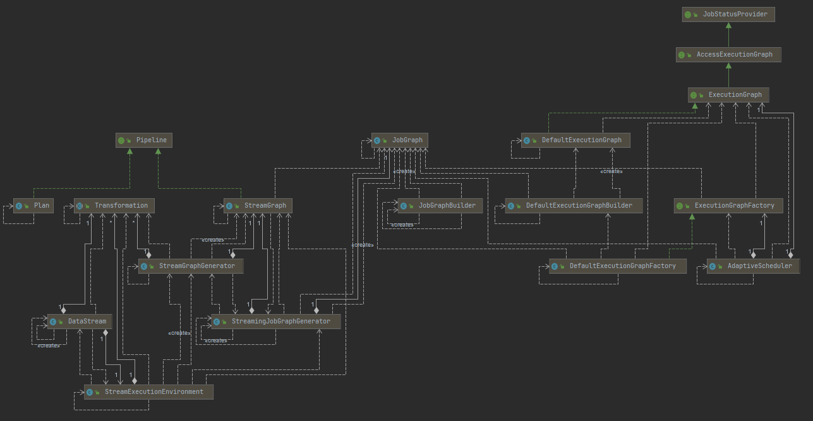

# DataStream & StreamGraph 生成

- [DataStream & Transformation & StreamOperator](#datastream--transformation--streamoperator)
- [StreamGraph 的生成](#streamgraph-的生成)
- [JobGraph 的生成](#jobgraph-的生成)

(current version 1.12.0)

## DataStream & Transformation & StreamOperator

- UML
    - 
- #### StreamExecutionEnvironment
    - 是1个Flink 作业的上下文信息, 包含 ExecuteConfig 和 CheckPointConfig
    - 提供了控制job执行的方法,和与外界交互的链接信息
        - set parallelism
        - checkpoint 参数

- #### DataStream & Transformation
    - DataStream 表示了由一种类型构成的数据流
    - 通过算子操作, 可以将一个DataStream转化为另一个DataStream, 转化的过程会抽象成 Transformation , 存到 StreamExecutionEnvironment 的
      transformations列表中
        - **也就是说**: 在 DataStream 上面通过算子不断进行转换，就得到了由 Transformation 构成的图。当需要执行的时候，底层的这个图就会被转换成 StreamGraph
    - Transformation 有一系列子类
    - DataStream 的子类
        - 

- #### StreamOperator
    - StreamOperator 定义了对一个具体的算子的生命周期的管理

```text
DataStream –> Transformation –> StreamOperator 这样的依赖关系，就可以完成 DataStream 的转换.
并且保留算子之间的依赖关系。
```

## 用户代码 -> StreamGraph -> JobGraph -> ExecutionGraph

- ```text
  StreamGraph: 从source开始, 遍历 transformations 生成 SteamNode 和 StreamEdge, 组成 StreamGraph (DAG)
  JobGraph: 从source开始, 遍历能 chain 到一起的 operator, 
      如果可以chain则chain到一起生成JobVertex, 不能chain的生成单独的JobVertex.
      通过 JobEdge 链接上下游的 JobVertex, 组成 JobGraph
  ExecutionGraph: jobVertex DAG 提交到任务以后，从 Source 节点开始排序,
      根据 JobVertex 生成ExecutionJobVertex，根据 jobVertex的IntermediateDataSet 构建IntermediateResult，
      然后 IntermediateResult 构建上下游的依赖关系， 形成 ExecutionJobVertex 层面的 DAG 即 ExecutionGraph。
  ```

### StreamGraph 的生成

- 图: StreamGraph -> JobGraph -> ExecutionGraph
    - 
- UML
    - 

- #### StreamGraph 生成
    - 1.StreamExecutionEnvironment.execute() 开始执行, 根据transformations, config 等, **构造出 StreamGraphGenerator**
    - 2.StreamGraphGenerator 遍历 transformations 构造出 StreamNode 和 StreamEdge 组成 DAG, 即 StreamGraph
        - StreamNode 是来描述 operator 的逻辑节点, 关键属性有 inEdges, outEdges , Class<? extends AbstractInvokable> jobVertexClass,
          slotSharingGroup slotSharingGroup
            - 每个StreamNode对象都携带有parallelism, slotSharingGroup, 执行类信息
        - StreamEge 是用来描述两个 operator 边(关系), 关键属性有 StreamNode sourceVertex, StreamNode targetVertex
    - {@link StreamExecutionEnvironment}, 根据transformations, config 等, 构造出 StreamGraphGenerator
        - ```java
          /** The execution configuration for this environment. */
          private final ExecutionConfig config = new ExecutionConfig();
        
          /** Settings that control the checkpointing behavior. */
          private final CheckpointConfig checkpointCfg = new CheckpointConfig();
        
          protected final List<Transformation<?>> transformations = new ArrayList<>();
          
          /**
            * {@link StreamExecutionEnvironment}
            *
            * @return
            */
          @Internal
          public StreamGraph getStreamGraph(String jobName, boolean clearTransformations) {
              StreamGraph streamGraph = getStreamGraphGenerator().setJobName(jobName).generate();
              if (clearTransformations) {
                  this.transformations.clear();
              }
              return streamGraph;
          }
          
          private StreamGraphGenerator getStreamGraphGenerator() {
              if (transformations.size() <= 0) {
                  throw new IllegalStateException("No operators defined in streaming topology. Cannot execute.");
              }
              // 获取 execution.runtime-mode 参数
              final RuntimeExecutionMode executionMode = configuration.get(ExecutionOptions.RUNTIME_MODE);
        
              return new StreamGraphGenerator(transformations, config, checkpointCfg, getConfiguration())
                  .setRuntimeExecutionMode(executionMode)
                  .setStateBackend(defaultStateBackend)
                  .setChaining(isChainingEnabled)
                  .setUserArtifacts(cacheFile)
                  .setTimeCharacteristic(timeCharacteristic)
                  .setDefaultBufferTimeout(bufferTimeout);
          }
          ```
    - {@link StreamGraphGenerator#generate} 方法生成 StreamGraph, 并且获得transformationId 列表
        - ```java
          /**
           * {@link StreamGraphGenerator#generate}
           *
           * @return
           */
          public StreamGraph generate() {
              streamGraph = new StreamGraph(executionConfig, checkpointConfig, savepointRestoreSettings);
              shouldExecuteInBatchMode = shouldExecuteInBatchMode(runtimeExecutionMode);
              configureStreamGraph(streamGraph);
              alreadyTransformed = new HashMap<>();
          
              /**
              * 1. 策略模式 匹配 xxxTransformation对应的 xxxTransformationTranslator 包装类(实现自接口TransformationTranslator Context 上下文包含StreamGraph等); 
              * 2. 调用 xxxTransformationTranslator 父类 AbstractOneInputTransformationTranslator#translateInternal;
              *    - StreamGraph 添加 Operator
              */
              for (Transformation<?> transformation: transformations) {
                  transform(transformation);
              }
          
              final StreamGraph builtStreamGraph = streamGraph;
              alreadyTransformed.clear();
              alreadyTransformed = null;
              streamGraph = null;
              return builtStreamGraph;
          }
          ```
        - 最终调用 AbstractOneInputTransformationTranslator#translateInternal
          ```java
          protected Collection<Integer> translateInternal(
          final Transformation<OUT> transformation,
          final StreamOperatorFactory<OUT> operatorFactory,
          final TypeInformation<IN> inputType,
          @Nullable final KeySelector<IN, ?> stateKeySelector,
          @Nullable final TypeInformation<?> stateKeyType,
          final Context context) {
          checkNotNull(transformation);
          checkNotNull(operatorFactory);
          checkNotNull(inputType);
          checkNotNull(context);
        
            final StreamGraph streamGraph = context.getStreamGraph();
            final String slotSharingGroup = context.getSlotSharingGroup();
            final int transformationId = transformation.getId();
            final ExecutionConfig executionConfig = streamGraph.getExecutionConfig();
        
            streamGraph.addOperator(
                transformationId,
                slotSharingGroup,
                transformation.getCoLocationGroupKey(),
                operatorFactory,
                inputType,
                transformation.getOutputType(),
                transformation.getName());
        
            if (stateKeySelector != null) {
                TypeSerializer<?> keySerializer = stateKeyType.createSerializer(executionConfig);
                streamGraph.setOneInputStateKey(transformationId, stateKeySelector, keySerializer);
            }
        
            int parallelism = transformation.getParallelism() != ExecutionConfig.PARALLELISM_DEFAULT
                ? transformation.getParallelism()
                : executionConfig.getParallelism();
            streamGraph.setParallelism(transformationId, parallelism);
            streamGraph.setMaxParallelism(transformationId, transformation.getMaxParallelism());
        
            final List<Transformation<?>> parentTransformations = transformation.getInputs();
            checkState(
                parentTransformations.size() == 1,
                "Expected exactly one input transformation but found " + parentTransformations.size());
        
            for (Integer inputId: context.getStreamNodeIds(parentTransformations.get(0))) {
                streamGraph.addEdge(inputId, transformationId, 0);
            }
        
            return Collections.singleton(transformationId);
          }
          ```

### JobGraph 的生成

- JobGraph 生成 PipelineExecutorUtils
- ```java
  	@Override
	public CompletableFuture<JobClient> execute(@Nonnull final Pipeline pipeline, @Nonnull final Configuration configuration, @Nonnull final ClassLoader userCodeClassloader) throws Exception {
		final JobGraph jobGraph = PipelineExecutorUtils.getJobGraph(pipeline, configuration);

		try (final ClusterDescriptor<ClusterID> clusterDescriptor = clusterClientFactory.createClusterDescriptor(configuration)) {
			final ExecutionConfigAccessor configAccessor = ExecutionConfigAccessor.fromConfiguration(configuration);

			final ClusterSpecification clusterSpecification = clusterClientFactory.getClusterSpecification(configuration);

			final ClusterClientProvider<ClusterID> clusterClientProvider = clusterDescriptor
					.deployJobCluster(clusterSpecification, jobGraph, configAccessor.getDetachedMode());
			LOG.info("Job has been submitted with JobID " + jobGraph.getJobID());

			return CompletableFuture.completedFuture(
					new ClusterClientJobClientAdapter<>(clusterClientProvider, jobGraph.getJobID(), userCodeClassloader));
		}
	}
  ```