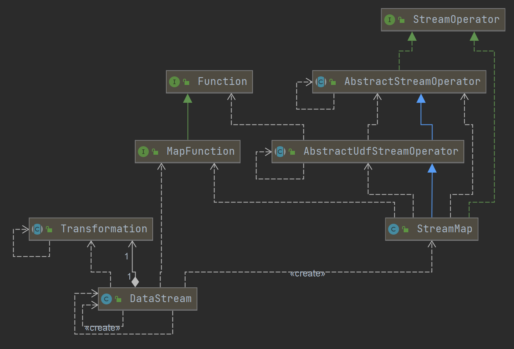

### 用户自定义 Function 在哪里被调用的

- MapFunction 为例, 如图这里使用了adaptor模式
    - Function和实际DataStream调用使用了adaptor模式
        - StreamOperator -> 具体的StreamXXX, 不同Operator对应不同实现, 这里使用了装饰器模式)
    - 
    - 用户设置MapFunction
        - 例如: DataStream.map(new MapFunction(){...})
- 用户自定义MapFunction最终被调用源码位置为
  [StreamMap](https://github.com/apache/flink/blob/master/flink-streaming-java/src/main/java/org/apache/flink/streaming/api/operators/StreamMap.java#L26)
    - ```java
      @Internal
      public class StreamMap<IN, OUT> extends AbstractUdfStreamOperator<OUT, MapFunction<IN, OUT>>
            implements OneInputStreamOperator<IN, OUT> {
      
          private static final long serialVersionUID = 1L;
      
          public StreamMap(MapFunction<IN, OUT> mapper) {
              super(mapper);
              chainingStrategy = ChainingStrategy.ALWAYS;
          }
      
          @Override
          public void processElement(StreamRecord<IN> element) throws Exception {
              output.collect(element.replace(userFunction.map(element.getValue())));
          }
      }
      ```
    - AbstractUdfStreamOperator
      - 抽象类, 提供自定义算子的