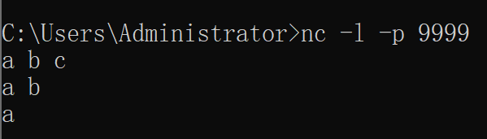

# Flink 本地开发环境准备
## 1. System 
- java 8+ or 11
- maven 3.6.x
- IDE
    - IntelliJ IDEA
    - or 其他
- 如果用scala开发flink, 请配置 scala 2.11 or 2.12环境
    - **注意**: EMR flink 依赖的scala版本为 2.11

## 2. 编写 [Hello word (Streaming API)](https://ci.apache.org/projects/flink/flink-docs-release-1.10/getting-started/tutorials/local_setup.html#read-the-code)
- ### 2.1 maven plugin 配置**请看本文末**
- ### 2.2 推荐的目录结构
    - 
- ### 2.3 java版代码示例
    - maven pom 配置
        - ```xml
          <properties>
              <scala.binary.version>2.11</scala.binary.version>
              <flink.version>1.10.1</flink.version>
          </properties>
          
          <dependencies>
              <dependency>
                  <groupId>org.apache.flink</groupId>
                  <artifactId>flink-streaming-java_${scala.binary.version}</artifactId>
                  <version>${flink.version}</version>
              </dependency>
              <dependency>
                  <groupId>org.apache.flink</groupId>
                  <artifactId>flink-test-utils_${scala.binary.version}</artifactId>
                  <version>${flink.version}</version>
                  <scope>test</scope>
              </dependency>
          </dependencies>
          ```
    - java hello Word 代码
        - [Read the Code](https://github.com/apache/flink/blob/master/flink-examples/flink-examples-streaming/src/main/java/org/apache/flink/streaming/examples/socket/SocketWindowWordCount.java)
- ### 2.4 scala版代码示例
    - maven pom 配置
        - ```xml
          <properties>
              <scala.version>2.11.12</scala.version>
              <scala.binary.version>2.11</scala.binary.version>
              <flink.version>1.10.1</flink.version>
          </properties>
          
          <dependencies>
              <!--scala-->
              <dependency>
                  <groupId>org.scala-lang</groupId>
                  <artifactId>scala-compiler</artifactId>
                  <version>${scala.version}</version>
              </dependency>
              <dependency>
                  <groupId>org.scala-lang</groupId>
                  <artifactId>scala-reflect</artifactId>
                  <version>${scala.version}</version>
              </dependency>
              <dependency>
                  <groupId>org.scala-lang</groupId>
                  <artifactId>scala-library</artifactId>
                  <version>${scala.version}</version>
              </dependency>
              <dependency>
                  <groupId>org.scala-lang</groupId>
                  <artifactId>scalap</artifactId>
                  <version>${scala.version}</version>
              </dependency>

              <!-- flink -->
              <dependency>
                  <groupId>org.apache.flink</groupId>
                  <artifactId>flink-streaming-scala_${scala.binary.version}</artifactId>
                  <version>${flink.version}</version>
              </dependency>
              <dependency>
                  <groupId>org.apache.flink</groupId>
                  <artifactId>flink-test-utils_${scala.binary.version}</artifactId>
                  <version>${flink.version}</version>
                  <scope>test</scope>
              </dependency>
          </dependencies>
          ```
    - scala hello Word 代码
        - ```scala
          import java.util.UUID
          
          import org.apache.commons.lang3.StringUtils
          import org.apache.flink.streaming.api.functions.timestamps.AscendingTimestampExtractor
          import org.apache.flink.streaming.api.scala.{DataStream, StreamExecutionEnvironment}
          import org.apache.flink.streaming.api.windowing.assigners.SlidingProcessingTimeWindows
          import org.apache.flink.streaming.api.windowing.time.Time
          
          object WordCountExample {
          
            def main(args: Array[String]): Unit = {
              val executionEnvironment: StreamExecutionEnvironment = StreamExecutionEnvironment.getExecutionEnvironment
          
              val socketDataStream: DataStream[SocketTestEntity] = getDataStreamFromLocalSocket(executionEnvironment = executionEnvironment)
          
              val wordCountStream: DataStream[Word] = wordCount(socketDataStream)
          
              wordCountStream.print()
          
              executionEnvironment.execute("Socket Window WordCount")
            }
          
            def wordCount(dataStream: DataStream[SocketTestEntity]): DataStream[Word] = {
          
              import org.apache.flink.streaming.api.scala._
          
              dataStream
                .map(entity => {
                  entity.text
                })
                .flatMap(text => {
                  text.split("\\W+")
                })
                .filter(str => {
                  StringUtils.isNotBlank(str)
                })
                .map(term => {
                  Word(term, 1L)
                })
                .keyBy("word")
                .window(SlidingProcessingTimeWindows.of(Time.seconds(60), Time.seconds(10)))
                .sum("count")
            }
          
            def getDataStreamFromLocalSocket(
                                              executionEnvironment: StreamExecutionEnvironment,
                                              hostname: String = "127.0.0.1",
                                              port: Int = 9999
                                            ): DataStream[SocketTestEntity] = {
              import org.apache.flink.streaming.api.scala._
          
              executionEnvironment.socketTextStream(hostname, port)
                .map(str => {
                  SocketTestEntity(
                    text = str
                  )
                })
                .assignTimestampsAndWatermarks(new AscendingTimestampExtractor[SocketTestEntity] {
                  override def extractAscendingTimestamp(element: SocketTestEntity): Long = {
                    element.server_time - 5000
                  }
                })
            }
          
            case class SocketTestEntity(
                                         uuid: String = UUID.randomUUID().toString,
                                         server_time: Long = System.currentTimeMillis(),
                                         text: String = ""
                                       )
          
            case class Word(
                             word: String,
                             count: Long
                           )
          
          }

          ```

## 3. 本地运行 Hello word 准备 (安装 netcat 插件) [Run the Example](https://ci.apache.org/projects/flink/flink-docs-release-1.10/getting-started/tutorials/local_setup.html#run-the-example) 
- ### 3.1 安装netcat插件
    - #### CentOS 7
        - ```shell script
            yum install -y nc
          ```
    - #### Windows
        - 下载[netcat](https://eternallybored.org/misc/netcat/)
        - 配置环境变量
- ### 3.2 运行 Hello word (Windows 10为例)
    - 命令行运行 nc -l -p 9999
        - 
    - IDE 运行 WordCountExample
    - 命令行 nc下 中输入单词
        - 
## 4. 效果展示
- 

## 5. maven常用插件
- ```xml
    <properties>
        <!--plugin-->
        <maven-surefire-plugin.version>2.22.2</maven-surefire-plugin.version>
        <scala-maven-plugin.version>3.4.6</scala-maven-plugin.version>
        <maven-compiler-plugin.version>3.6.2</maven-compiler-plugin.version>
        <maven-resources-plugin.version>3.0.2</maven-resources-plugin.version>
        <maven-shade-plugin.version>3.2.1</maven-shade-plugin.version>
        <maven-assembly-plugin.version>3.1.1</maven-assembly-plugin.version>
    </properties>
  
    <build>
        <plugins>
            <!-- java compiler -->
            <plugin>
                <groupId>org.apache.maven.plugins</groupId>
                <artifactId>maven-compiler-plugin</artifactId>
                <version>${maven-compiler-plugin.version}</version>
                <configuration>
                    <source>${java.version}</source>
                    <target>${java.version}</target>
                    <encoding>UTF-8</encoding>
                </configuration>
            </plugin>

            <!-- resource -->
            <plugin>
                <groupId>org.apache.maven.plugins</groupId>
                <artifactId>maven-resources-plugin</artifactId>
                <version>${maven-resources-plugin.version}</version>
                <configuration>
                    <encoding>UTF-8</encoding>
                </configuration>
                <!--<executions>
                    <execution>data/</execution>
                </executions>-->
            </plugin>

            <!-- scala compiler -->
            <plugin>
                <groupId>net.alchim31.maven</groupId>
                <artifactId>scala-maven-plugin</artifactId>
                <version>${scala-maven-plugin.version}</version>
                <executions>
                    <execution>
                        <id>scala-compile-first</id>
                        <phase>process-resources</phase>
                        <goals>
                            <goal>add-source</goal>
                            <goal>compile</goal>
                        </goals>
                    </execution>
                </executions>
                <configuration>
                    <scalaVersion>${scala.version}</scalaVersion>
                    <recompileMode>incremental</recompileMode>
                    <useZincServer>true</useZincServer>
                    <args>
                        <arg>-unchecked</arg>
                        <arg>-deprecation</arg>
                        <arg>-feature</arg>
                    </args>
                    <jvmArgs>
                        <jvmArg>-Xms1024m</jvmArg>
                        <jvmArg>-Xmx2048m</jvmArg>
                    </jvmArgs>
                    <javacArgs>
                        <javacArg>-source</javacArg>
                        <javacArg>${java.version}</javacArg>
                        <javacArg>-target</javacArg>
                        <javacArg>${java.version}</javacArg>
                        <javacArg>-Xlint:all,-serial,-path</javacArg>
                    </javacArgs>
                </configuration>
            </plugin>

            <plugin>
                <groupId>org.apache.maven.plugins</groupId>
                <artifactId>maven-surefire-plugin</artifactId>
                <version>${maven-surefire-plugin.version}</version>
                <configuration>
                    <skipTests>true</skipTests>
                </configuration>
            </plugin>
        </plugins>

        <pluginManagement>
            <plugins>
                <plugin>
                    <groupId>org.apache.maven.plugins</groupId>
                    <artifactId>maven-shade-plugin</artifactId>
                    <version>${maven-shade-plugin.version}</version>

                    <configuration>
                        <finalName>${project.name}</finalName>
                        <shadedArtifactAttached>true</shadedArtifactAttached>
                        <shadedClassifierName>jar-with-dependencies</shadedClassifierName>
                        <filters>
                            <filter>
                                <artifact>*:*</artifact>
                                <excludes>
                                    <exclude>META-INF/*.SF</exclude>
                                    <exclude>META-INF/*.DSA</exclude>
                                    <exclude>META-INF/*.RSA</exclude>
                                    <exclude>junit:junit</exclude>
                                    <exclude>org.apache.maven:lib:tests</exclude>
                                </excludes>
                            </filter>
                        </filters>
                        <transformers>
                            <transformer
                                    implementation="org.apache.maven.plugins.shade.resource.AppendingTransformer">
                                <resource>META-INF/spring.handlers</resource>
                            </transformer>
                            <transformer
                                    implementation="org.apache.maven.plugins.shade.resource.AppendingTransformer">
                                <resource>META-INF/spring.schemas</resource>
                            </transformer>
                        </transformers>
                    </configuration>
                    <executions>
                        <execution>
                            <phase>package</phase>
                            <goals>
                                <goal>shade</goal>
                            </goals>
                        </execution>
                    </executions>
                </plugin>

                <plugin>
                    <groupId>org.apache.maven.plugins</groupId>
                    <artifactId>maven-assembly-plugin</artifactId>
                    <version>${maven-assembly-plugin.version}</version>

                    <configuration>
                        <outputDirectory>${project.build.directory}/releases/</outputDirectory>
                        <descriptors>
                            <descriptor>${basedir}/src/main/resources/assembly-descriptor.xml</descriptor>
                        </descriptors>
                        <useJvmChmod>true</useJvmChmod>
                    </configuration>
                    <executions>
                        <execution>
                            <phase>package</phase>
                            <goals>
                                <goal>single</goal>
                            </goals>
                        </execution>
                    </executions>
                </plugin>
            </plugins>
        </pluginManagement>
    </build>
  ``` 